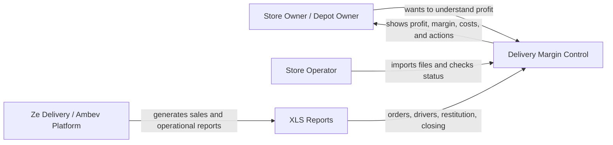
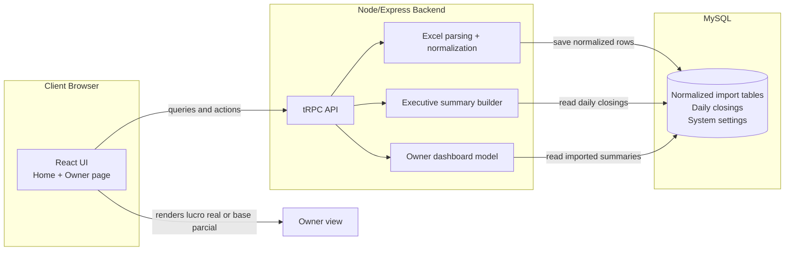
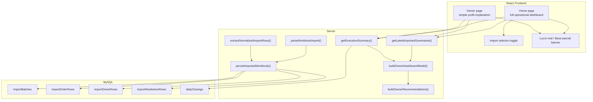

# C4 Diagram - Ze Delivery Profit System

This diagram describes what was built to help a store owner understand real profit from Ze Delivery reports.

## 1. System Context



## 2. Container Diagram



## 3. Component Diagram



## 4. What changed in the system

- Excel files are now stored as normalized batches in MySQL.
- The dashboard no longer trusts empty zero objects before imported data.
- The owner page uses a simple reading mode:
  - `Conta fechada`
  - `Conta incompleta`
- The app explains profit in plain language:
  - money in
  - money out
  - money left
- The owner sees the business through one lens:
  - revenue
  - cost
  - loss
  - profit
  - next action

## 5. Main business rule

```text
lucro = dinheiro que entra - gastos - perdas
```

If an essential file is missing, the system shows a partial view instead of fake zero values.

