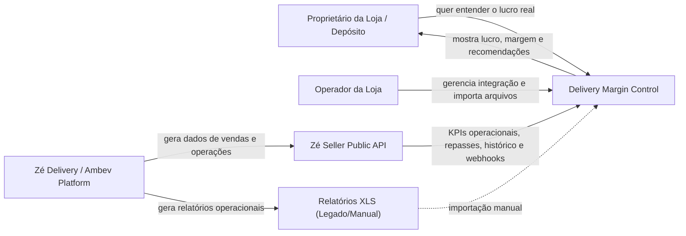
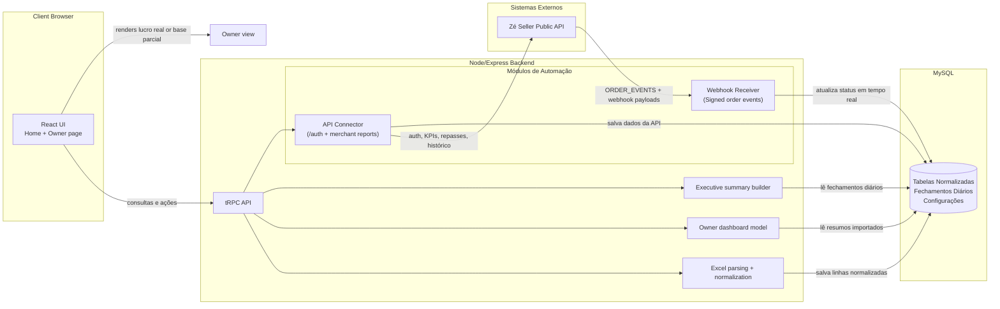

# C4 Diagram - Delivery Margin Control

This document describes the merged system: one Delivery Margin Control app with legacy XLS ingestion and the Zé Delivery API integration inside the same codebase.

## 1. System Context



## 2. Container Diagram



## 3. Component Diagram

```mermaid
flowchart TB
  subgraph UI["React Frontend"]
    HomePage["Home page\nfull operational dashboard"]
    OwnerPage["Owner page\nsimple profit explanation"]
    ImportToggle["Import selector toggle"]
    ReadingBanner["Lucro real / Base parcial banner"]
  end

  subgraph Server["Server"]
    ZeClient["server/zeDeliveryClient.ts"]
    ZeRouter["server/zeDeliveryRouter.ts"]
    ZeWebhook["server/webhooks/ze-delivery.ts"]
    ParseWorkbook["parseWorkbookImport()"]
    ParseRows["extractNormalizedImportRows()"]
    PersistImport["persistImportedWorkbook()"]
    ImportedSummaries["getLatestImportedSummaries()"]
    ExecSummary["getExecutiveSummary()"]
    OwnerModel["buildOwnerDashboardModel()"]
    OwnerRec["buildOwnerRecommendations()"]
  end

  subgraph DB["MySQL"]
    Batches["importBatches"]
    OrderRows["importOrderRows"]
    DriverRows["importDriverRows"]
    RestRows["importRestitutionRows"]
    ApiCreds["apiCredentials"]
    ApiCache["apiKpiCache"]
    Events["orderEvents"]
    Closings["dailyClosings"]
  end

  HomePage --> ImportToggle
  HomePage --> ReadingBanner
  OwnerPage --> ReadingBanner
  HomePage --> ImportedSummaries
  OwnerPage --> ImportedSummaries
  HomePage --> ExecSummary
  OwnerPage --> ExecSummary

  ParseWorkbook --> PersistImport
  ParseRows --> PersistImport
  ZeRouter --> ZeClient
  ZeRouter --> ApiCreds
  ZeClient --> ApiCache
  ZeWebhook --> Events
  PersistImport --> Batches
  PersistImport --> OrderRows
  PersistImport --> DriverRows
  PersistImport --> RestRows

  ImportedSummaries --> OwnerModel
  ExecSummary --> OwnerModel
  OwnerModel --> OwnerRec
  ExecSummary --> Closings
```



## 4. Current Folder Shape

- `client/` contains the React UI.
- `server/` contains the Express/tRPC backend.
- `server/zeDeliveryClient.ts`, `server/zeDeliveryRouter.ts`, and `server/zeDeliveryDb.ts` contain the Zé Delivery API connector and mock fallback.
- `server/webhooks/ze-delivery.ts` receives real-time order events and stores them in `orderEvents`.
- `client/src/pages/Login.tsx` supports either live credentials or mock/demo mode.
- `drizzle/` contains MySQL schema and migrations.
- `fixtures/xlsx/` contains legacy XLS samples for local validation.

## 5. Main business rule

```text
lucro = dinheiro que entra - gastos - perdas
```

If an essential file is missing, the system shows a partial view instead of fake zero values.
